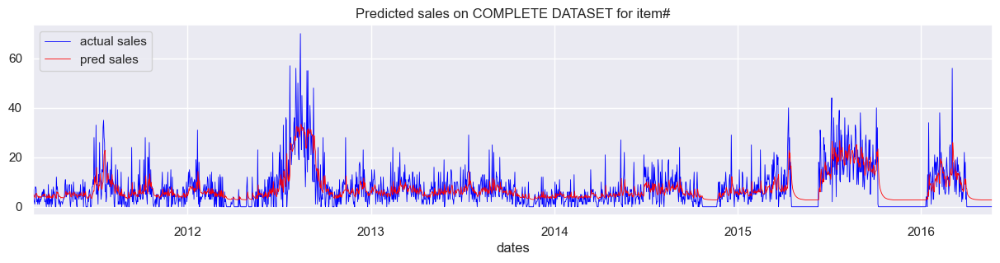
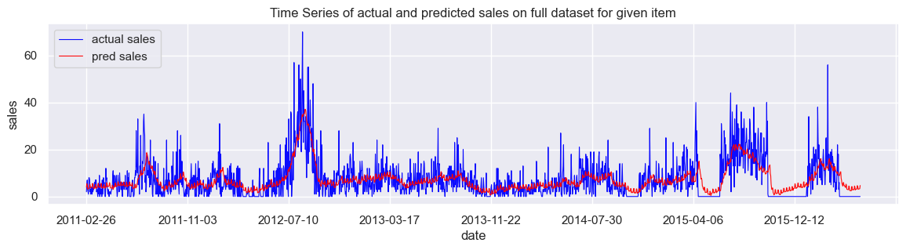

# Time Series Forecasting for Sales Data

This project focuses on **time series forecasting** using LSTM (Long Short-Term Memory) models to predict future sales for a specific item based on historical sales data. The analysis is divided into two parts:

1. **Univariate Analysis**: Predict sales based on a single feature (past sales).
2. **Multivariate Analysis**: Incorporate additional features such as lag features, rolling statistics, and event types to improve predictions.

The project is implemented in Python using libraries such as `pandas`, `numpy`, `matplotlib`, `seaborn`, and `PyTorch`.

This README provides a detailed explanation of both approaches, including preprocessing, model architecture, training, evaluation, and results.

---

## Table of Contents

- [Dataset](#dataset)
- [Univariate Analysis](#univariate-analysis)
  - [Preprocessing](#preprocessing)
  - [Model Architecture](#model-architecture)
    - [Hyperparameters](#hyperparameters)
  - [Training and Evaluation](#training-and-evaluation)
  - [Results](#results)
- [Multivariate Analysis](#multivariate-analysis)
  - [Feature Engineering](#feature-engineering)
  - [Preprocessing](#preprocessing-1)
  - [Model Architecture](#model-architecture-1)
    - [Hyperparameters](#hyperparameters-1)
  - [Training and Evaluation](#training-and-evaluation-1)
- [Results](#results-1)
  - [Possible Reasons](#possible-reasons)
  - [Next Steps](#next-steps)
- [Dependencies](#dependencies)

---

## Dataset

The dataset used in this project is from the **M5 Forecasting Accuracy** competition. It includes:
- **Calendar Data**: Contains date-related information such as weekdays, events, and holidays.
- **Sales Data**: Contains daily sales for various items across multiple stores.

The dataset is available at:
[https://www.kaggle.com/competitions/m5-forecasting-accuracy/data](https://www.kaggle.com/competitions/m5-forecasting-accuracy/data)

The dataset is preprocessed to extract relevant information and prepare it for time-series analysis.

---

## Univariate Analysis

### Preprocessing

1. **Data Cleaning**:
   - Remove unnecessary columns (`item_id`, `dept_id`, `cat_id`, `store_id`, `state_id`).
   - Standardize the `id` column by removing the `_evaluation` suffix.
2. **Data Reshaping**:
   - Reshape the sales data to a day-wise format.
   - Merge sales data with calendar dates.
3. **Normalization**:
   - Normalize sales data using Min-Max scaling to the range `[-1, 1]`.
4. **Sequence Creation**:
   - Generate input-output sequences for time-series forecasting.

### Model Architecture

The model used for univariate forecasting is an **LSTM (Long Short-Term Memory)** neural network. The architecture includes:

- **Input Layer**: Accepts sequences of past sales data.
- **LSTM Layer**: Captures temporal dependencies in the data.
- **Fully Connected Layer**: Maps the LSTM output to a single predicted sales value.

#### Hyperparameters

- Input size: `1` (univariate time series)
- Hidden size: `16`
- Number of LSTM layers: `1`
- Learning rate: `0.08`
- Batch size: `128`
- Number of epochs: `50`

### Training and Evaluation

- The model is trained using the **Adam optimizer** and **Mean Squared Error (MSE)** loss function.
- Training is performed for 50 epochs, with validation loss computed every 10 epochs.
- The model is evaluated on both the **full dataset** and the **test dataset**.

### Results

- The model captures the general trend in sales with a correlation of 0.686.



---

## Multivariate Analysis

### Feature Engineering

1. **Lag Features**: Sales values from the past `[7, 14, 30, 180, 365]` days.
2. **Rolling Window Statistics**: Mean and standard deviation of sales over `[7, 14, 30, 180, 365]` days.
3. **Weekend Feature**: Binary feature indicating whether a day is a weekend (`1`) or a weekday (`0`).
4. **Event Type Categories**: Numerical mapping of event types (e.g., Religious, National, Cultural, Sporting, No event).

### Preprocessing

- Remove unnecessary columns (`item_id`, `dept_id`, `cat_id`, `store_id`, `state_id`).
- Create lag features, rolling window statistics, and event type features.
- Normalize sales data using Min-Max scaling to the range `[-1, 1]`.
- Generate input-output sequences for time-series forecasting.

### Model Architecture

The model used for multivariate forecasting is an **LSTM (Long Short-Term Memory)** neural network. The architecture includes:

- **Input Layer**: Accepts sequences of past sales data and additional features.
- **LSTM Layer**: Captures temporal dependencies in the data.
- **Fully Connected Layer**: Maps the LSTM output to a single predicted sales value.

#### Hyperparameters

The hyperparameter tuning is performed with the following parameter grid, and the best hyperparameters are chosen with minimum validation loss.

```python
param_grid = {  
    "hidden_size_mv": [8, 16, 32, 64],  
    "dropout": [0.1, 0.2],  
    "num_layers": [1, 2],  
    "num_epochs_mv": [50, 100]  
}
```

- Input size: `17`
- Hidden size: `32`
- Number of LSTM layers: `1`
- Dropout rate: `0.1`
- Learning rate: `0.0001`
- Batch size: `32`
- Number of epochs: `100`

### Training and Evaluation

- The model is trained using the **Adam optimizer** and **Mean Squared Error (MSE)** loss function.
- Training is performed for 100 epochs, with validation loss computed every 20 epochs.
- The model is evaluated on both the **full dataset** and the **test dataset**.

## Results  

Even after conducting a detailed multivariate analysis with multiple features, we observe that the results do not significantly differ from the univariate analysis. This indicates that the additional features are not contributing substantial new information to the model’s predictive power.  



### Possible Reasons  

1. **Multicollinearity**: Some features may be highly correlated with each other, leading to redundancy in the model.  
2. **Lack of Non-linearity Capture**: The current approach may not be effectively capturing complex relationships between features and the target variable.  
3. **Irrelevant Features**: Some of the added features may not have a meaningful impact on the target variable, reducing their overall contribution.  

### Next Steps  

- **Interaction Terms & Polynomial Features**: Introduce interaction terms or polynomial transformations to capture non-linear dependencies.  
- **Compare Model Types**: Test non-linear models like **Random Forest** and **XGBoost** to identify potential improvements.  

---

## Dependencies

To install dependencies, run:
```bash
pip install pandas numpy matplotlib seaborn scikit-learn torch scipy
